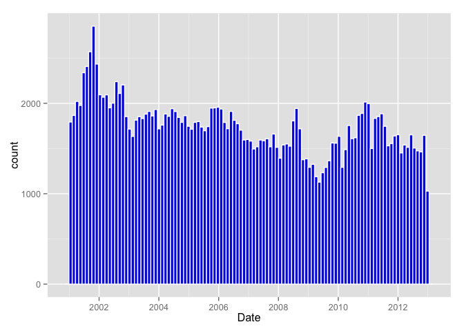
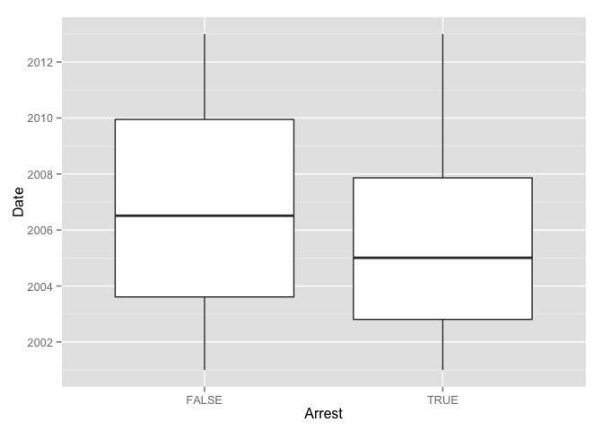

# assignment1_crime
Xiang Li  
May 1, 2016  

There are two main types of crimes: violent crimes, and property crimes. In this problem, we'll focus on one specific type of property crime, called "motor vehicle theft" (sometimes referred to as grand theft auto). This is the act of stealing, or attempting to steal, a car. In this problem, we'll use some basic data analysis in R to understand the motor vehicle thefts in Chicago. 

## Problem 1 - Loading the Data

```r
library(data.table)
# setup working directory
path = '/Users/apple/Google Drive/BangBang/4_Xiang_study/4_analytic_edge/Assignments/hw1'
setwd(path)

# import data
crime = fread('mvtWeek1.csv',na.strings="NA", stringsAsFactors=FALSE)
dim(crime) # number of obervations; number of columns
```

```
## [1] 191641     11
```

```r
head(crime) # example of data
```

```
##         ID           Date           LocationDescription Arrest Domestic
## 1: 8951354 12/31/12 23:15                        STREET  FALSE    FALSE
## 2: 8951141 12/31/12 22:00                        STREET  FALSE    FALSE
## 3: 8952745 12/31/12 22:00 RESIDENTIAL YARD (FRONT/BACK)  FALSE    FALSE
## 4: 8952223 12/31/12 22:00                        STREET  FALSE    FALSE
## 5: 8951608 12/31/12 21:30                        STREET  FALSE    FALSE
## 6: 8950793 12/31/12 20:30                        STREET   TRUE    FALSE
##    Beat District CommunityArea Year Latitude Longitude
## 1:  623        6            69 2012 41.75628 -87.62164
## 2: 1213       12            24 2012 41.89879 -87.66130
## 3: 1622       16            11 2012 41.96919 -87.76767
## 4:  724        7            67 2012 41.76933 -87.65773
## 5:  211        2            35 2012 41.83757 -87.62176
## 6: 2521       25            19 2012 41.92856 -87.75400
```

```r
summary(crime) # get basic statistics of each variable
```

```
##        ID              Date           LocationDescription   Arrest       
##  Min.   :1310022   Length:191641      Length:191641       Mode :logical  
##  1st Qu.:2832144   Class :character   Class :character    FALSE:176105   
##  Median :4762956   Mode  :character   Mode  :character    TRUE :15536    
##  Mean   :4968629                                          NA's :0        
##  3rd Qu.:7201878                                                         
##  Max.   :9181151                                                         
##                                                                          
##   Domestic            Beat         District     CommunityArea  
##  Mode :logical   Min.   : 111   Min.   : 1.00   Min.   : 0     
##  FALSE:191226    1st Qu.: 722   1st Qu.: 6.00   1st Qu.:22     
##  TRUE :415       Median :1121   Median :10.00   Median :32     
##  NA's :0         Mean   :1259   Mean   :11.82   Mean   :38     
##                  3rd Qu.:1733   3rd Qu.:17.00   3rd Qu.:60     
##                  Max.   :2535   Max.   :31.00   Max.   :77     
##                                 NA's   :43056   NA's   :24616  
##       Year         Latitude       Longitude     
##  Min.   :2001   Min.   :41.64   Min.   :-87.93  
##  1st Qu.:2003   1st Qu.:41.77   1st Qu.:-87.72  
##  Median :2006   Median :41.85   Median :-87.68  
##  Mean   :2006   Mean   :41.84   Mean   :-87.68  
##  3rd Qu.:2009   3rd Qu.:41.92   3rd Qu.:-87.64  
##  Max.   :2012   Max.   :42.02   Max.   :-87.52  
##                 NA's   :2276    NA's   :2276
```


```r
nrow(crime[Arrest ==1]) # the number of crimes for which an arrest was made
nrow(crime[LocationDescription == 'ALLEY']) #observations have a LocationDescription value of ALLEY
```

```
## [1] 15536
## [1] 2308
```

## Problem 2 - Understanding Dates in R

```r
# This converts the variable "Date" into a Date object in R
DateConvert = as.Date(strptime(crime[,Date], "%m/%d/%y %H:%M"))
summary(DateConvert)

# extract the month and the day of the week, and add these variables to our data table crime
crime[,c("Month","Weekday") := list(months(DateConvert),weekdays(DateConvert))] # data table assign multiple columns

crime[,Date := DateConvert] # replace the old Date variable with DateConvert 
```


```r
head(crime[, list(Date,Month,Weekday)])
```

```
##          Date    Month Weekday
## 1: 2012-12-31 December  Monday
## 2: 2012-12-31 December  Monday
## 3: 2012-12-31 December  Monday
## 4: 2012-12-31 December  Monday
## 5: 2012-12-31 December  Monday
## 6: 2012-12-31 December  Monday
```

```r
sort(table(crime[,Month])) # which month did the fewest motor vehicle thefts occur
```

```
## 
##  February     April     March      June       May   January September 
##     13511     15280     15758     16002     16035     16047     16060 
##  November  December    August      July   October 
##     16063     16426     16572     16801     17086
```

```r
sort(table(crime[,Weekday])) # which weekday did the most motor vehicle thefts occur
```

```
## 
##    Sunday   Tuesday  Saturday  Thursday    Monday Wednesday    Friday 
##     26316     26791     27118     27319     27397     27416     29284
```

```r
# Which month has the largest number of motor vehicle thefts for which an arrest was made
sort(table(crime[Arrest=='TRUE',Month]))
```

```
## 
##       May      June  February September     April  November     March 
##      1187      1230      1238      1248      1252      1256      1298 
##      July    August   October  December   January 
##      1324      1329      1342      1397      1435
```
## Problem 3 - Visualizing Crime Trends

```r
library(ggplot2)
# make a histogram of the variable Date.breaks => specify the number of bars we want in our histogram
ggplot(crime,aes(x = Date)) + geom_histogram(binwidth = 40, colour = 'white', fill = 'blue')
```

<!-- -->

```r
# let's see how arrests have changed over time. Create a boxplot of the variable "Date", sorted by the variable "Arrest"
ggplot(crime, aes(x = Arrest, y = Date)) + geom_boxplot()
```

<!-- -->

```r
# what proportion of motor vehicle thefts in 2001 was an arrest made
prop.table(table(crime[year(Date)==2001,Arrest]))
```

```
## 
##     FALSE      TRUE 
## 0.8958827 0.1041173
```

```r
# get proportion of motor vehicle thefts was an arrest made in each year
prop.table(table(crime[,list(year(Date),Arrest)]),margin = 1)
```

```
##       Arrest
## V1          FALSE       TRUE
##   2001 0.89588272 0.10411728
##   2002 0.88721805 0.11278195
##   2003 0.89205739 0.10794261
##   2004 0.89959673 0.10040327
##   2005 0.90730405 0.09269595
##   2006 0.91912039 0.08087961
##   2007 0.91512605 0.08487395
##   2008 0.92938733 0.07061267
##   2009 0.93096080 0.06903920
##   2010 0.95476544 0.04523456
##   2011 0.96003070 0.03996930
##   2012 0.96097076 0.03902924
```

## Problem 4 - Popular Locations

```r
# find the top five locations where motor vehicle thefts occur,excluding the "Other" category
# in data.table, data[,.N, by = var1] is counting rows by column var1
Top5_agg = crime[LocationDescription != 'OTHER', .N, by= LocationDescription][order(-N)][1:5]
print(Top5_agg)
```

```
##               LocationDescription      N
## 1:                         STREET 156564
## 2: PARKING LOT/GARAGE(NON.RESID.)  14852
## 3:                          ALLEY   2308
## 4:                    GAS STATION   2111
## 5:         DRIVEWAY - RESIDENTIAL   1675
```

```r
# number of observations are in Top5
Top5_agg[,sum(N)] # sum column N in data table Top5
```

```
## [1] 177510
```

```r
# subset crime data for top 5 locations
Top5 = crime[LocationDescription %in% Top5_agg[,LocationDescription],] 
# refresh the LocationDescription factor variable
Top5[,LocationDescription := factor(Top5[,LocationDescription])]
```

```
##              ID       Date LocationDescription Arrest Domestic Beat
##      1: 8951354 2012-12-31              STREET  FALSE    FALSE  623
##      2: 8951141 2012-12-31              STREET  FALSE    FALSE 1213
##      3: 8952223 2012-12-31              STREET  FALSE    FALSE  724
##      4: 8951608 2012-12-31              STREET  FALSE    FALSE  211
##      5: 8950793 2012-12-31              STREET   TRUE    FALSE 2521
##     ---                                                            
## 177506: 1310068 2001-01-01              STREET  FALSE    FALSE 1123
## 177507: 1313404 2001-01-01              STREET  FALSE    FALSE 2023
## 177508: 1313442 2001-01-01              STREET  FALSE    FALSE  911
## 177509: 1563324 2001-01-01              STREET  FALSE    FALSE 1712
## 177510: 1310463 2001-01-01              STREET  FALSE    FALSE 1911
##         District CommunityArea Year Latitude Longitude    Month Weekday
##      1:        6            69 2012 41.75628 -87.62164 December  Monday
##      2:       12            24 2012 41.89879 -87.66130 December  Monday
##      3:        7            67 2012 41.76933 -87.65773 December  Monday
##      4:        2            35 2012 41.83757 -87.62176 December  Monday
##      5:       25            19 2012 41.92856 -87.75400 December  Monday
##     ---                                                                
## 177506:       NA            NA 2001 41.88757 -87.71132  January  Monday
## 177507:       NA            NA 2001 41.98192 -87.65888  January  Monday
## 177508:       NA            NA 2001 41.79902 -87.69654  January  Monday
## 177509:       NA            NA 2001 41.97144 -87.72706  January  Monday
## 177510:       NA            NA 2001 41.96833 -87.69639  January  Monday
```

```r
# One of the locations has a much higher arrest rate than the other locations
prop.table(table(Top5[,list(LocationDescription,Arrest)]),margin = 1)
```

```
##                                 Arrest
## LocationDescription                   FALSE       TRUE
##   ALLEY                          0.89211438 0.10788562
##   DRIVEWAY - RESIDENTIAL         0.92119403 0.07880597
##   GAS STATION                    0.79204169 0.20795831
##   PARKING LOT/GARAGE(NON.RESID.) 0.89206841 0.10793159
##   STREET                         0.92594083 0.07405917
```

```r
# On which day of the week do the most motor vehicle thefts at gas stations happen?
sort(table(Top5[LocationDescription=='GAS STATION',Weekday]),decreasing = TRUE)
```

```
## 
##  Saturday    Sunday    Friday  Thursday    Monday Wednesday   Tuesday 
##       338       336       332       282       280       273       270
```

```r
# On which day of the week do the fewest motor vehicle thefts in residential driveways happen?
sort(table(Top5[LocationDescription=='DRIVEWAY - RESIDENTIAL',Weekday]))
```

```
## 
##  Saturday    Sunday Wednesday   Tuesday    Monday    Friday  Thursday 
##       202       221       234       243       255       257       263
```

